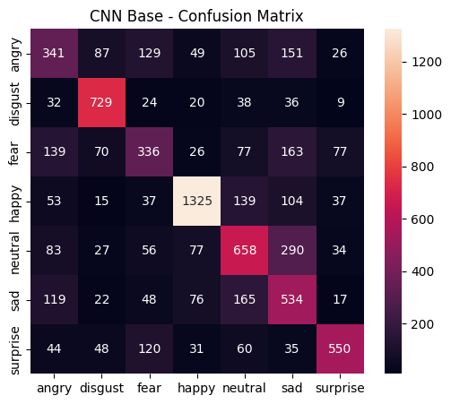
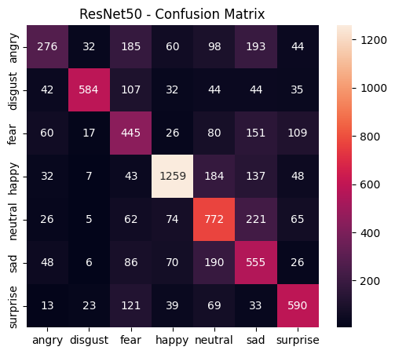
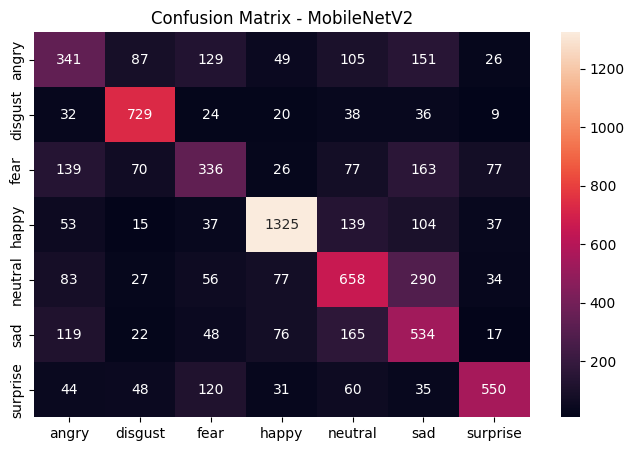
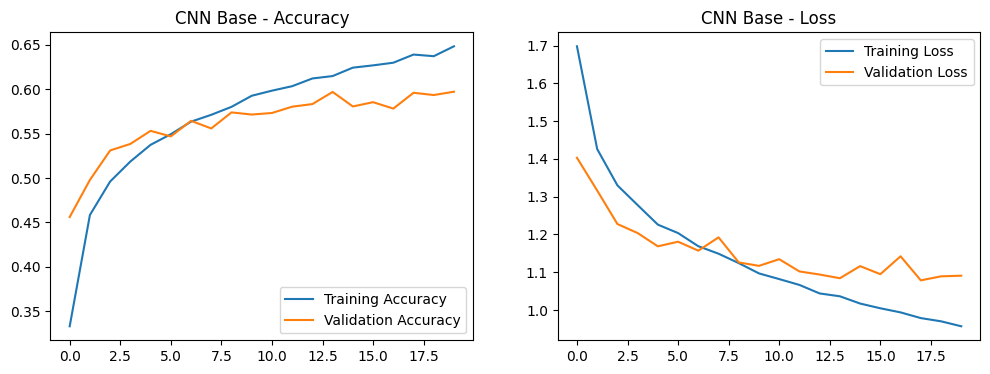
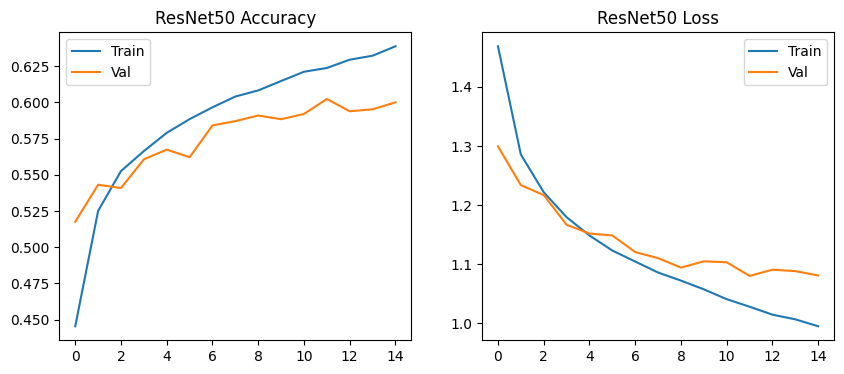
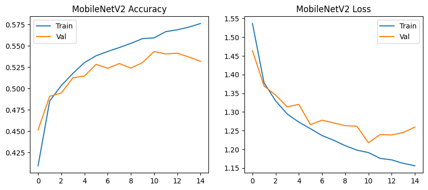
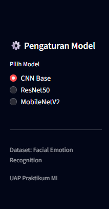
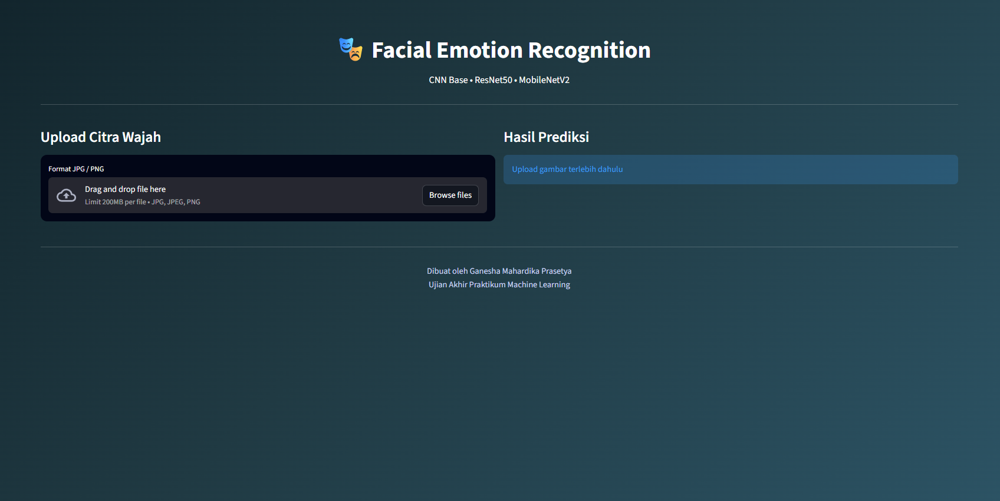
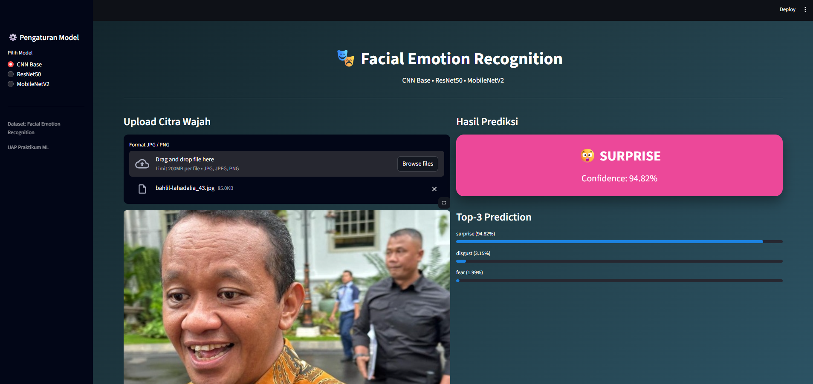

<h1 align="center">Klasifikasi Ekspresi Wajah</h1>

  

  <strong>Klasifikasi Emosi Wajah Menggunakan Convolutional Neural Network (CNN), ResNet50, dan MobileNetV2</strong>

---

## Biodata

- Nama : Ganesha Mahardika Prasetya
- NIM  : 202210370311156
- Kelas  : Pembelajaran Mesin C
- Hobi  : Pasang 10 Tim
- Cita-cita : Nonton JKT48

---

<h1 align="center">Deskripsi Project</h1>

Project ini bertujuan untuk membangun sistem Klasifikasi Emosi Wajah menggunakan pendekatan Deep Learning guna mengklasifikasikan ekspresi wajah manusia ke dalam tujuh kategori emosi. Sistem dikembangkan dengan membandingkan performa tiga arsitektur model, yaitu satu model Neural Network Base (non-pretrained) dan dua model Transfer Learning (pretrained).

---

## Sumber Dataset

- **Judul Dataset**: *Facial Emotion Recognition Dataset*
- **Link**: [Kaggle - Facial Emotion Recognition Dataset](https://www.kaggle.com/datasets/fahadullaha/facial-emotion-recognition-dataset?select=processed_data)
- **Daftar Kelas Emosi**:
  - Angry
  - Disgust
  - Fear
  - Happy
  - Neutral
  - Sad
  - Surprise
 
---

## Preprocessing Data

Tahapan preprocessing dilakukan untuk memastikan data siap digunakan dalam proses pelatihan model, meliputi:

- Resize gambar ke ukuran seragam (224 × 224 piksel)

- Konversi warna ke format RGB

- Normalisasi nilai piksel

- Pembagian dataset ke dalam data train, validation, dan test

- Data Augmentation untuk meningkatkan variasi data dan mencegah overfitting, dengan teknik:

  - RandomFlip

  - RandomRotation

  - RandomZoom

  - RandomContrast

---

## Pemodelan

Tiga model Deep Learning dibangun dan dibandingkan pada project ini, yaitu satu model CNN Base (non-pretrained) dan dua model Transfer Learning (pretrained). Seluruh model menggunakan fungsi loss Sparse Categorical Crossentropy dan metrik evaluasi Accuracy.

### **CNN Base (Non-Pretrained)**
Model CNN sederhana yang dilatih dari awal tanpa bobot pretrained dan digunakan sebagai baseline model.
Data augmentation diterapkan langsung pada arsitektur model untuk meningkatkan generalisasi.

#### Arsitektur utama CNN Base:
- Data Augmentation

- Rescaling (1/255)

- Convolution Layer (32 filter)

- Max Pooling

- Convolution Layer (64 filter)

- Flatten

- Dense (128 neuron, ReLU)

- Dense Output (Softmax – 7 kelas emosi)

#### Konfigurasi Training:
- Optimizer: Adam

- Loss: Sparse Categorical Crossentropy

- Epoch: 20

- Menggunakan Class Weight

- Model disimpan sebagai: models/cnn_base_New.keras

### **ResNet50 (Pretrained – Transfer Learning)**
Model kedua menggunakan ResNet50 pretrained ImageNet sebagai feature extractor.
Backbone ResNet50 dibekukan (freeze) dan hanya bagian classifier yang dilatih.

#### Arsitektur utama ResNet50:
- Input (224 × 224 × 3)

- Data Augmentation

- ResNet50 Backbone (Frozen)

- Global Average Pooling

- Dense (128 neuron, ReLU)

- Dense Output (Softmax – 7 kelas emosi)

#### Konfigurasi Training:
- Optimizer: Adam (learning rate = 1e-4)

- Loss: Sparse Categorical Crossentropy

- Epoch: 15

- Menggunakan Class Weight

- Model disimpan sebagai: models/resnet50_New.keras

### **MobileNetV2 (Pretrained – Transfer Learning)**
Model ketiga menggunakan MobileNetV2 pretrained ImageNet, yang dirancang lebih ringan dan efisien dibanding ResNet50.

#### Arsitektur utama MobileNetV2:
- Input (224 × 224 × 3)

- Data Augmentation

- MobileNetV2 Backbone (Frozen)

- Global Average Pooling

- Dense (128 neuron, ReLU)

- Dense Output (Softmax – 7 kelas emosi)

#### Konfigurasi Training:
- Optimizer: Adam (learning rate = 1e-4)

- Loss: Sparse Categorical Crossentropy

- Epoch: 15

- Menggunakan Class Weight

- Model disimpan sebagai: models/mobilenetv2_New.keras

---

## Evaluasi dan Analisis Model

Evaluasi dilakukan untuk mengukur performa tiga model yang telah dibangun, yaitu CNN Base (non-pretrained), ResNet50 (Transfer Learning), dan MobileNetV2 (Transfer Learning).
Pengujian dilakukan pada data test dan dievaluasi menggunakan metrik standar klasifikasi, meliputi:

- Accuracy

- Precision

- Recall

- F1-Score

- Confusion Matrix

- Grafik Loss dan Accurac

### Tabel Perbandingan Performa Model

| Model      | Accuracy   | Precision (Macro) | Recall (Macro) | F1-score (Macro) | 
| ---------- | ---------- | ----------------- | -------------- | ---------------- |
| CNN        | 0.5990     | 0.58              | 0.58           | 0.58             |
| ResNet50   | **0.6000** | **0.61**          | **0.58**       | **0.58**         |
| MobileNetV2 | 0.5311     | 0.54              | 0.52           | 0.53             |

#### CNN Base (Non-Pretrained)
Model CNN Base dilatih dari awal tanpa bobot pretrained dan digunakan sebagai baseline model.
Model ini mampu mengenali emosi dominan seperti happy dan disgust dengan cukup baik, namun mengalami kesulitan dalam membedakan emosi yang memiliki kemiripan visual seperti fear, sad, dan angry.

#### ResNet50 (Transfer Learning)
ResNet50 menunjukkan performa terbaik dan paling stabil di antara ketiga model.
Dengan memanfaatkan bobot pretrained ImageNet, model mampu mengekstraksi fitur wajah yang lebih kompleks dan diskriminatif

#### MobileNetV2 (Transfer Learning)
MobileNetV2 merupakan model yang ringan dan efisien, dirancang untuk kebutuhan komputasi rendah.
Meskipun mampu mengenali beberapa emosi dengan cukup baik, performanya masih berada di bawah ResNet50 dan CNN Base.

### Tabel Analisis Model
| Model      | Accuracy   | Hasil Analisis    |
| ---------- | ---------- | ----------------- | 
| CNN        | 0.5990     | Model baseline tanpa pretrained. Mampu mengenali emosi dominan namun kurang optimal pada emosi kompleks yang memiliki kemiripan visual.             |
| ResNet50   | 0.6000     | Model dengan performa terbaik dan paling stabil. Transfer learning membantu ekstraksi fitur wajah yang lebih kuat dan seimbang          | 
| MobileNetV2 | 0.5311     | Model ringan dan efisien. Cocok untuk deployment, namun memiliki akurasi paling rendah di antara ketiga model.             |

### Visualisasi Evaluasi Model
| **CNN** | **ResNet50** | **MobileNetV2** |
|---------|---------|-------------------|
|  |  |  |

### Grafik Loss dan Accuracy
| **CNN** | **ResNet50** | **MobileNetV2** |
|---------|---------|-------------------|
|  |  |  |

---
## Streamlit
#### 1. Pilih Model
Di sidebar Pengaturan Model, pilih salah satu model yang ingin digunakan:
- CNN
- ResNet50
- MobileNetV2

  

#### 2. Upload Citra Wajah
- Klik tombol Browse files atau drag & drop file gambar wajah.
- Format yang didukung: JPG, JPEG, PNG.
- Ukuran maksimal: 200 MB per file.

  

#### 3. Lihat Hasil Prediksi
Setelah upload:
- Bagian Hasil Prediksi menampilkan emosi utama yang terdeteksi beserta confidence dalam persentase.
- Bagian Top-3 Prediction menampilkan tiga kemungkinan emosi teratas beserta probabilitasnya.

  

#### Interpretasi Hasil
- Confidence tinggi = model cukup yakin dengan prediksi emosi.
- Top-3 Prediction = berguna jika wajah menampilkan emosi campuran atau ambigu.
